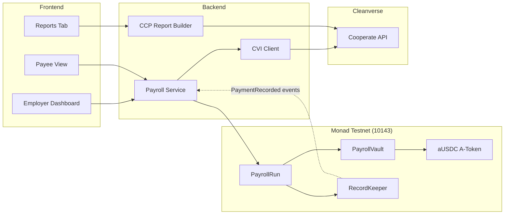

# Architecture

## System overview

## Smart contracts

### PayrollVault

- `deposit(amount)` — employer deposits aUSDC, tracked per wallet
- `withdraw(amount)` — employer withdraws unspent balance
- `balanceOf(employer)` — view balance
- `payOut(employer, to, amount)` — only PayrollRun; debits vault and transfers CVA

### RecordKeeper

- Pure event emitter + optional index for demo queries
- `PaymentRecorded(employer, payee, amount, runId, timestamp)` per successful payment

### PayrollRun

- `runPayroll(Payee[])` — batch payout with **skip-and-log** semantics
- Per-payee `try/catch` around `vault.payOut` — one bad payee won't revert the batch
- Off-chain CVI check is primary; A-Token transfer rules are on-chain backstop

## Off-chain service

| Module | Role |
|--------|------|
| CVI client | `verify_apass`, `query_apass`, cache per payee |
| Chain listener | Parses `PaymentRecorded` from tx receipt after `runPayroll` |
| CCP builder | `download_travel_rule` with batch tx hash + employer wallet |
| Scheduler | Manual trigger for demo (`POST /payroll-runs`); cron is roadmap |

## Term mapping

| Plan term | Cleanverse | Endpoint |
|-----------|------------|----------|
| CVI | A-Pass verification | `/verify_apass`, `/query_apass` |
| CVA | A-Token (aUSDC) | `/query_deposit_atoken_list` |
| CCP report | Travel Rule report | `/download_travel_rule` |

## Security notes

- Sandbox API keys belong in `.env` only — never commit `.env`
- Demo employer key is for testnet only
- Production: use a signer service / HSM, Postgres for run storage, websocket indexer
